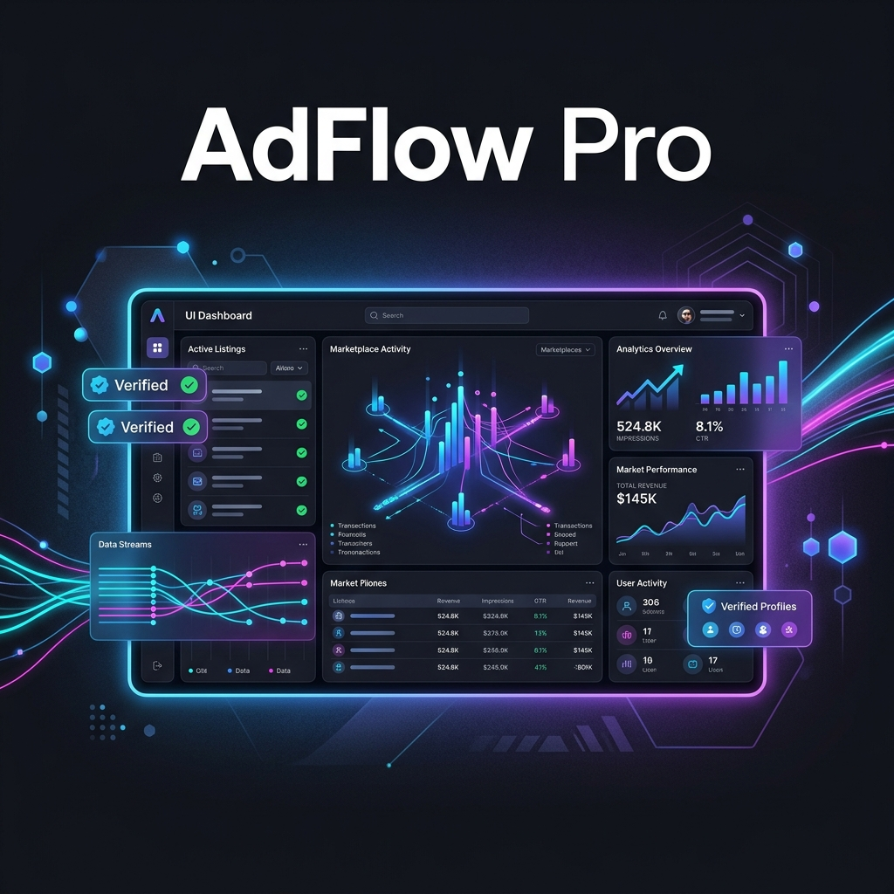

# 🚀 AdFlow Pro — Next-Gen Marketplace Engine



[](https://adsflow-pro.vercel.app/)
[](https://nextjs.org/)
[](https://www.typescriptlang.org/)
[](https://supabase.com/)
[](https://tailwindcss.com/)

**AdFlow Pro** is a premium, production-ready marketplace platform built for scale. Featuring a robust moderation system, tiered package-based listings, and real-time analytics, it provides a seamless experience for buyers, sellers, and administrators alike.

---

## 🌟 Key Features

### 🛒 For Sellers
- **Package-Based Listings**: Choose from Basic, Standard, or Premium plans with different durations and visibility weights.
- **Media Management**: Upload high-quality images or link YouTube videos to showcase products.
- **Rich Dashboards**: Track ad performance, status history, and payment verifications.
- **Real-Time Notifications**: Get notified instantly when your ad is approved or requires action.

### 🛡️ For Moderators & Admins
- **Multi-Role System**: Fine-grained access control for Clients, Moderators, Admins, and Super Admins.
- **Ad Moderation Queue**: Review, approve, or reject listings with custom notes.
- **Payment Verification**: Dedicated workflow for verifying manual payment screenshots and transaction references.
- **Audit Logging**: Complete transparency with detailed logs for every administrative action.
- **System Health Monitoring**: Real-time tracking of external service response times and status.

### 📊 Advanced Analytics
- **Performance Charts**: Visualize listing trends and user engagement using Recharts.
- **Smart Ranking**: Ads are automatically ranked based on package strength, freshness, and featured status.

---

## 🛠️ Tech Stack

- **Framework**: [Next.js 14](https://nextjs.org/) (App Router, Server Actions)
- **Language**: [TypeScript](https://www.typescriptlang.org/)
- **Database**: [PostgreSQL](https://www.postgresql.org/) (via [Supabase](https://supabase.com/))
- **Authentication**: [Supabase Auth](https://supabase.com/auth)
- **State Management**: [Zustand](https://github.com/pmndrs/zustand) & [React Query](https://tanstack.com/query/latest)
- **Styling**: [Tailwind CSS](https://tailwindcss.com/)
- **Form Handling**: [React Hook Form](https://react-hook-form.com/) with [Zod](https://zod.dev/) validation
- **Icons**: [Lucide React](https://lucide.dev/)
- **Charts**: [Recharts](https://recharts.org/)

---

## 🚀 Getting Started

### Prerequisites
- Node.js 18.x or later
- A Supabase account

### Installation

1. **Clone the repository**
   ```bash
   git clone https://github.com/ahmad-nawaz978/adsflow-pro.git
   cd adsflow-pro
   ```

2. **Install dependencies**
   ```bash
   npm install
   ```

3. **Configure Environment Variables**
   Create a `.env` file in the root directory (refer to `.env.example`):
   ```bash
   cp .env.example .env
   ```
   Fill in your Supabase credentials and JWT secret.

4. **Initialize Database**
   Run the contents of `schema.sql` in your Supabase SQL Editor to create tables, indexes, and RLS policies.

5. **Run the Development Server**
   ```bash
   npm run dev
   ```
   Open [http://localhost:3000](http://localhost:3000) to see the result.

---

## 📁 Project Structure

```text
src/
├── app/            # Next.js App Router (Pages, API Routes)
├── components/     # Reusable UI Components
├── hooks/          # Custom React Hooks
├── lib/            # Shared Utilities & Configurations
├── services/       # Data Fetching & API Logic
├── store/          # Zustand State Management
└── types/          # TypeScript Definitions
```

---

## 🔒 Security

- **Row Level Security (RLS)**: Fine-grained database access control via Postgres policies.
- **JWT Authentication**: Secure session management.
- **Server Actions**: Secure server-side logic execution.
- **Security Headers**: XSS and Clickjacking protection configured in `next.config.js`.

---

## 📄 License

Distributed under the MIT License. See `LICENSE` for more information.

---

<p align="center">
  Built with ❤️ by the AdFlow Pro Team
</p>
